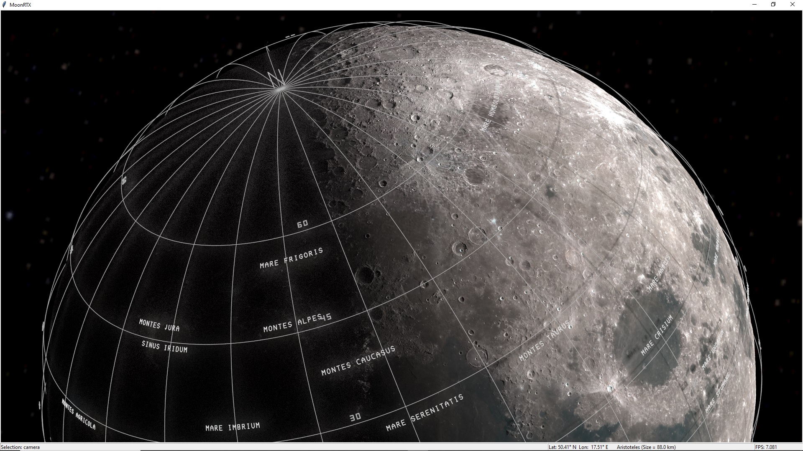

# MoonRTX
MoonRTX is ray-traced, ultra-realistic Moon observatory developed in Python. It uses [PlotOptiX](https://github.com/rnd-team-dev/plotoptix) package and is based on PlotOptiX use example [making_the_moon__displacement](https://github.com/rnd-team-dev/plotoptix/blob/master/examples/3_projects/moon/making_the_moon__displacement.ipynb).

## Requirements
- Python
- pip (Python package manager)
- **NVIDIA RTX graphics card with installed NVIDIA drivers**
- As of now application was tested only on Windows. I have no possibility to test it under Linux. Nevertheless, it should run on Linux when PlotOptiX prerequisites for this OS are met. More details [here](https://github.com/rnd-team-dev/plotoptix?tab=readme-ov-file#linux-prerequisites)

## Install
```bash
git clone https://github.com/albireo77/moonrtx.git  # or download and unpack source code zip file
cd moonrtx
pip install -r requirements.txt
```
## Run

MoonRTX can be run in 2 ways:
- Command line (examples):

`python -m moonrtx.main --help`

`python -m moonrtx.main --time "2023-05-28T19:39:00+01:00" --lat 50.1 --lon 20.0`

`python -m moonrtx.main --lat -35.1 --lon -20.4 --downscale 4 --brightness 100`

`python -m moonrtx.main --init-view "2025-03-07T18.53.00+01.00_lat+50.000000_lon+20.000000_cambMOZPzVT28IXi6y_bMOZP6uZGsEXi6y_AAAAAAAAAAAAAIA_5oB3QA"`  
where `--init-view` parameter value is taken from the screenshot default filename
- GUI launcher:

`python -m moonrtx.main_gui_launcher`

## Notes
- On first run, around 9GB of data (most of all [Lunar Orbiter Laser Altimeter](https://science.nasa.gov/mission/lro/lola) elevation map) is to be downloaded so internet connection and sufficient disk space is required.
- Rendering Moon scene can take around 1 minute depending on `--downscale` parameter  value.

## Keyboard and Mouse Actions
**G** - Toggle selenographic grid  
**L** - Toggle standard labels  
**S** - Toggle spot labels  
**I** - Toggle upside down view  
**U** - Toggle labels upside down  
**P** - Toggle pins ON/OFF  
**1-9** - Create/Remove pin (when pins are ON)  
**R** - Reset view and time to initial state  
**V** - Reset view to that based on current time (useful after starting with `--init-view` parameter)  
**C** - Center and fix view on point under cursor  
**F** - Search for Moon features (craters, mounts etc.)  
**F12** - Save image  
**Arrows** - Navigate view  
**A/Z** - Increase/Decrease brightness  
**Q/W** - Go back/forward in time by step minutes  
**M/N** - Increase/Decrease time step by 1 minute (max is 1440 - 1 day)  
**Shift + M/N** - Increase/Decrease time step by 60 minutes (max is 1440 - 1 day)  
**Ctrl + Left/Right** - Rotate view around Moon's polar axis  
**Ctrl + Up/Down** - Rotate view around Moon's equatorial axis  
**Hold and drag left mouse button** - Rotate the eye around Moon  
**Hold and drag right mouse button** - Rotate Moon around the eye  
**Hold shift + right mouse button and drag up/down** - Move eye backward/forward  
**Hold shift + left mouse button and drag up/down** - Zoom out/in (more reliable)  
**Mouse wheel up/down** - Zoom in/out (less reliable)  

## Screens
**Plato and its surroundings**

**Selenographic grid and labels**

**Lonely Timocharis**

**Rima Hesiodus and the distant Rupes Recta**


