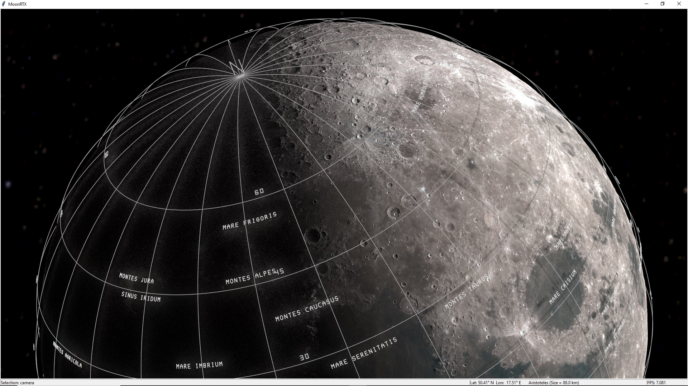
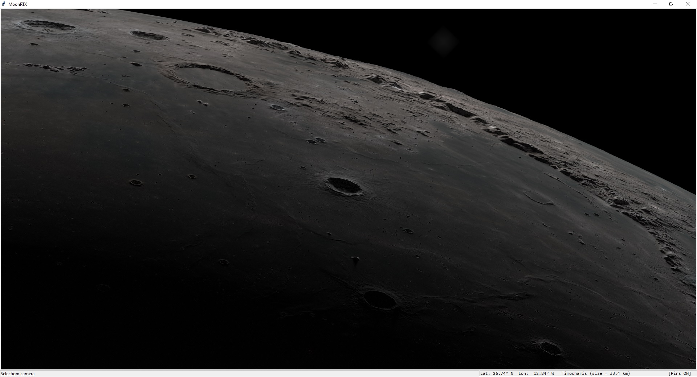

# MoonRTX
MoonRTX is ray-traced, ultra-realistic Moon observatory developed in Python. It uses [PlotOptiX](https://github.com/rnd-team-dev/plotoptix) package and is based on PlotOptiX use example [making_the_moon__displacement](https://github.com/rnd-team-dev/plotoptix/blob/master/examples/3_projects/moon/making_the_moon__displacement.ipynb).

## Requirements
- Python
- pip (Python package manager)
- **NVIDIA RTX graphics card with installed latest NVIDIA drivers**
- As of now application was tested only on Windows. I have no possibility to test it under Linux. Nevertheless, it should run on Linux when PlotOptiX prerequisites for this OS are met. More details [here](https://github.com/rnd-team-dev/plotoptix?tab=readme-ov-file#linux-prerequisites)

## Install
```bash
git clone https://github.com/albireo77/moonrtx.git  # or download and unpack source code zip file
cd moonrtx
pip install -r requirements.txt
```
## Run

MoonRTX can be run in 2 ways:
- Command line (examples):

`python -m moonrtx.main --help`

`python -m moonrtx.main --time "2023-05-28T19:39:00+01:00" --lat 50.1 --lon 20.0`

`python -m moonrtx.main --lat -35.1 --lon -20.4 --downscale 4 --brightness 100`

`python -m moonrtx.main --init-view "2025-03-07T19.53.00+01.00_lat+50.000000_lon+20.000000_viewSNEW_par1_camAAAAAAAAyMIAAAAAAAAAAAAAAAAAAAAAAAAAAAAAAAAAAIA_F6dJQA"`  
where `--init-view` parameter value is taken from the screenshot default filename
- GUI launcher:

`python -m moonrtx.main_gui_launcher`

## Notes
- On first run, around 9GB of data (most of all [Lunar Orbiter Laser Altimeter](https://science.nasa.gov/mission/lro/lola) elevation map) is to be downloaded so internet connection and sufficient disk space is required.
- On first Moon ephemeris calculation, MoonRTX may download a small Skyfield data set into `moonrtx/data/skyfield`: the JPL `de421.bsp` ephemeris (about 16 MB) plus three small Moon orientation kernels used for the direct lunar body-frame rotation.
- The bundled Skyfield Moon orientation kernels support dates from `1900-01-01T00:00:00+00:00` through `2051-01-01T00:00:00+00:00`.
- Current MoonRTX will only work correctly with PlotOptix 0.19.2+
- Downscaling of elevation map can take even around 1 minute depending on `--downscale` parameter value (lower value = more time). Once downscaled for the first time, downscaled map is cached in `data` directory as .npy file.
- If you don't like default Moon colors in MoonRTX, you can download file with more realistic (though bland) colors from [NASA site](https://svs.gsfc.nasa.gov/4720) and load it with `--color-file` parameter on program start.

## Keyboard and Mouse Actions
**F1** - Help  
**F2** - Toggle Moon ephemeris panel  
**F4** - Toggle parallactic mode (maintains Moon aligned to celestial north)  
**F5-F8** - Change view orientation (NSWE, NSEW, SNEW, SNWE)  
**F9** - Set time to now using system timezone  
**F10** - Set time to now + start auto-advance  
**F12** - Save image  
**1-9** - Create/Remove pin (when pins are ON)  
**G** - Toggle selenographic grid  
**L** - Toggle standard labels  
**S** - Toggle spot labels  
**P** - Toggle pins ON/OFF  
**R** - Reset view and time to initial state  
**V** - Reset view to that based on current time (useful after starting with `--init-view` parameter)  
**C** - Center and fix view on point under cursor  
**F** - Search for Moon features (craters, mounts etc.)  
**I** - Open USGS web page for Moon feature shown in status bar  
**O** - Open user defined web page (Wiki by default) for Moon feature shown in status bar  
**T** - Open date/time window  
**X** - Toggle exact terminator shadows (rendering gets significantly slower while ON)  
**A/Z** - Increase/Decrease brightness  
**E/D** - Increase/Decrease gamma correction  
**H/J** - Roll view around current view direction  
**Q/W** - Go back/forward in time by step minutes (hold the key to get an animation effect)  
**M/N** - Increase/Decrease time step by 1 minute (max is 1440 - 1 day)  
**Shift + M/N** - Increase/Decrease time step by 60 minutes (max is 1440 - 1 day)  
**Arrows** - Move view  
**Ctrl + Left/Right** - Rotate view around Moon's polar axis  
**Ctrl + Up/Down** - Rotate view around Moon's equatorial axis  
**Hold and drag left mouse button** - Rotate the eye around Moon  
**Hold and drag right mouse button** - Rotate Moon around the eye (move view)  
**Hold Shift + right mouse button and drag up/down** - Move eye backward/forward  
**Hold Ctrl + drag left mouse button** - Measure distance and elevation difference on Moon surface  
**Hold Shift + left mouse button and drag up/down** - Zoom out/in (more reliable)  
**Mouse wheel up/down** - Zoom in/out (less reliable)  

## Screens
**Archimedes with neighbours**

**Selenographic grid and labels**

**Lonely Timocharis**

**Rima Hesiodus and the distant Rupes Recta**

**Maria with [Blue Steel color map](https://astrogeology.usgs.gov/search/map/moon_lro_lola_color_shaded_relief_blue_steel_474m)**

**Mare Smythii in 2 projections (standard and Blue Steel)**

**Measuring the depth (Δh) of Theophilus**


